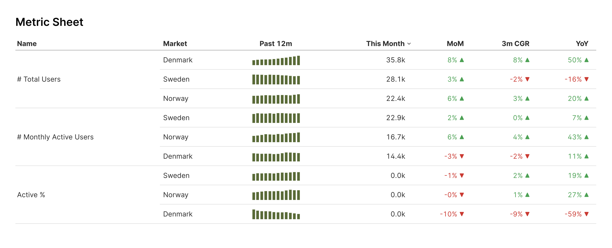

# Metric Sheet



## Overview

**Metric Sheet** is a simple example of how [Evidence](https://evidence.dev/) can be used for monthly reporting. It provides a clean and interactive way to track key metrics over time, with filters for month, market, and specific metrics. The project is built using dummy data and serves as a demonstration of Evidence’s capabilities.

You can explore the live version of the web app here: [Metric Sheet Web App](https://rasmusengelbrecht.github.io/evidence-metric-sheet/).

## Features

- **Monthly Metric Tracking:** View key business metrics over time.
- **Interactive Filters:** Select specific months, markets, and metrics to analyze.
- **Growth Analysis:** Compare Month-over-Month (MoM), Year-over-Year (YoY), and Compound Growth Rates (CGR) over different time frames.
- **Historical Data Trends:** View historical metric trends over the past 12 months.
- **Visualizations:** Sparkline charts and line charts for trend analysis.

## How It Works

Metric Sheet processes data using SQL-based queries within Evidence. Here’s a breakdown of the main components:

### Data Query

The core SQL query calculates key performance indicators, including:
- **Month-over-Month (MoM) percentage change**
- **Year-over-Year (YoY) percentage change**
- **3-month and 12-month Compound Growth Rates (CGRs)**
- **Historical values for the last 12 months**

```sql
SELECT
    name,
    month + interval '2 hours' AS month, -- Correcting for timezone differences
    market,
    metric_value,
    1.00 * (metric_value - LAG(metric_value) OVER (PARTITION BY name, market ORDER BY month)) / nullif(LAG(metric_value) OVER (PARTITION BY name, market ORDER BY month), 0) as mom_pct,
    1.00 * (metric_value - LAG(metric_value, 12) OVER (PARTITION BY name, market ORDER BY month)) / nullif(LAG(metric_value) OVER (PARTITION BY name, market ORDER BY month), 0) as yoy_pct,
    1.00 *((metric_value / nullif(LAG(metric_value, 3) OVER (PARTITION BY name, market ORDER BY month), 0))^(1/3)-1) as cgr_3_month_new_pct,
    1.00 *((metric_value / nullif(LAG(metric_value, 12) OVER (PARTITION BY name, market ORDER BY month), 0))^(1/12)-1) as cgr_12_month_new_pct,
    ARRAY_AGG({'month': month, 'metric_value': metric_value}) OVER (
        PARTITION BY name, market
        ORDER BY month
        ROWS BETWEEN 11 PRECEDING AND CURRENT ROW
    ) AS metric_value_last_12_months
FROM
    csv_files.metric_sheet_dummy_data;
```

### Filters

Users can filter the data dynamically using dropdowns for:
- **Month Selection**
- **Market Selection** (multi-select enabled)
- **Metric Selection** (multi-select enabled)

### Data Visualization

- **Metric Table:** Displays key metric values and growth percentages.
- **Sparkline Charts:** Shows historical trends over the past 12 months.
- **Line Charts:** Illustrates trends in selected metrics over time.


## Learn More

For more details about Evidence and how it works, visit the official [Evidence documentation](https://evidence.dev/).

---

**Author:** Rasmus Engelbrecht  
**License:** MIT